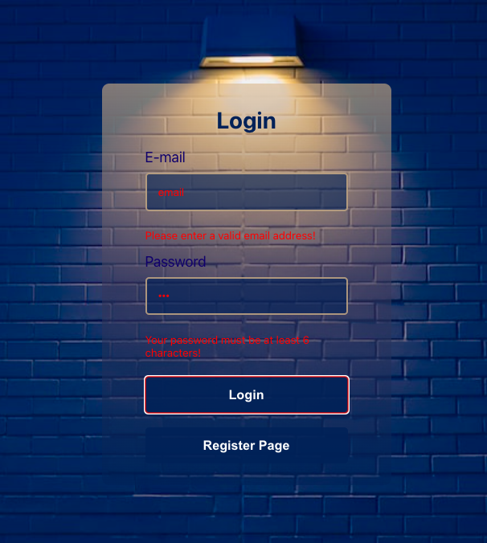
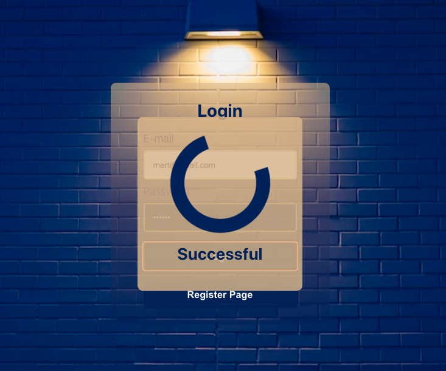
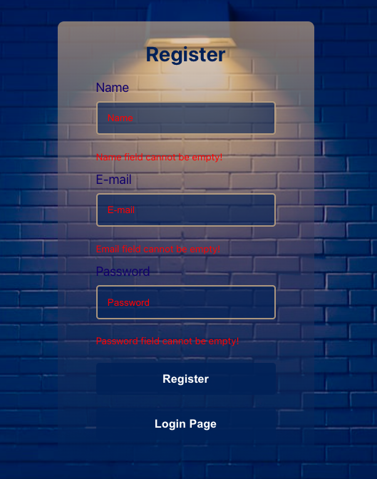
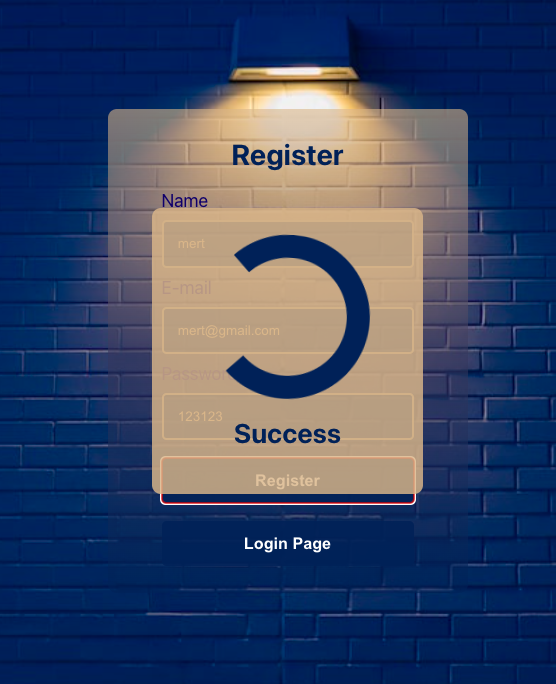
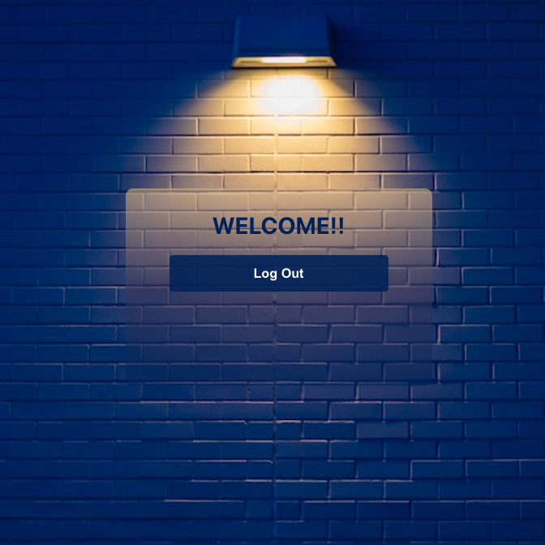

# Login and Registration Page with React

> Simple login/register-page-app created with React js.

## Live App

> [Link](react-login-register-page.vercel.app/)

## Functionalities

- Login with username and password
- Create an account
- Validation


## Technologies

- React js
- HTML5
- CSS3


## Contributing

The process to start is simple, just make sure you have Node js installed in your computer.

```
-> git clone [Repository]

-> cd [Repository-Directory]

-> npm install

-> npm start
```

or

```
-> git clone [Repository]

-> cd [Repository-Directory]

-> yarn install

-> yarn start
```

---

## Application Photos

### Login Page


---

### Login Page Error



---

### Login Page Successful



---

### Register Page


---

### Register Page Error



---

### Register Page Succesful



---

### Login Screen


